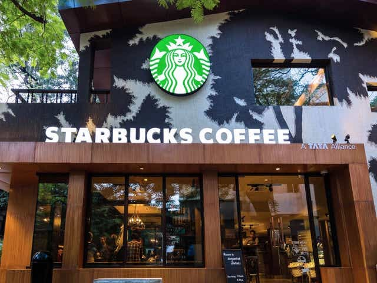

Data scientist at Udacity Nanodegree Capstone Project

BLOG POST :(https://medium.com/@nani90103/starbucks-project-d9de78c3bfd6).

This repository has all the code and reports for my Udacity Data Scientist Nanodegree Capstone project.

## Starbucks Capstone Challenge: Using Starbucks app user data to predict effective offers

### 1. Services
This project was written in Python, using Jupyter Notebook in Anaconda. The Python packages relevant for this project are the following:

Panda
- numb
- mathematics
- Json
- sklearn.model_selection (train_test_split module)
- sklearn.preprocessing (StandardScaler, PolynomialFeatures)
- from sklearn.tree (DecisionTreeClassifier, DecisionTreeRegressor)
- sklearn.ensemble (RandomForestClassifier)
- sklearn.metrics (mean_squared_error, rating_report)
- sklearn.linear_model (Ridge)
- Now
- sklearn.model_selection (GridSearchCV)
- matplotlib

### 2. Motivation of the project
This project is the Capstone project of my Data Scientist nanodegree with Udacity. As nanograde students, we have the opportunity to participate in the Capb Starbucks Challenge.
For the challenge, Udacity provided simulated data that a member's mandate is the main predictor of the effectiveness of an offer. Further studies could indicate which average holding days would result in an effective BOGO offering.

### 3. File descriptions
This repository contains 4 files. My project report is called "Starbucks Capstone Challenge: Using Starbucks app user data to predict effective.ipynb offers."
The data used in the project are available in the portfolio.json, profile.json and transcript.json files.

### 4.Results
Based on transcription records, we created an array of user elements that represents how users responded to the offers they received. We then divide the records into the training set and the test set and train our SVD algorithm to predict how a user responds to a particular offer. We achieved the lowest mean squared error around 0.003823 with 15 latent characteristics with the training set and around 0.009175 with 10 latent characteristics with the test set. After that, we created a recommendation engine recommended by Starbucks, the offer of which should be sent to a particular user.

We discovered which demographic groups respond best to each type of offer. Women respond much better than men, both in BOGO and on discount. Men react a little better to the discount than BOGO. We also discovered that it is better to promote the offer through social networks. Among the ten offers, the $ 10 buy shipping gets $ 2 off a 10-day offer via email, web, mobile, and social, earning Starbucks more. It is the best offer so far!

### 5. Licenses, authors, thank you, etc.

The data for the coding project were provided by Udacity.
Author : https://github.com/Narendrasai-Bathula/Starbucks-Project
Credits : wikipedia & stackoverflow
